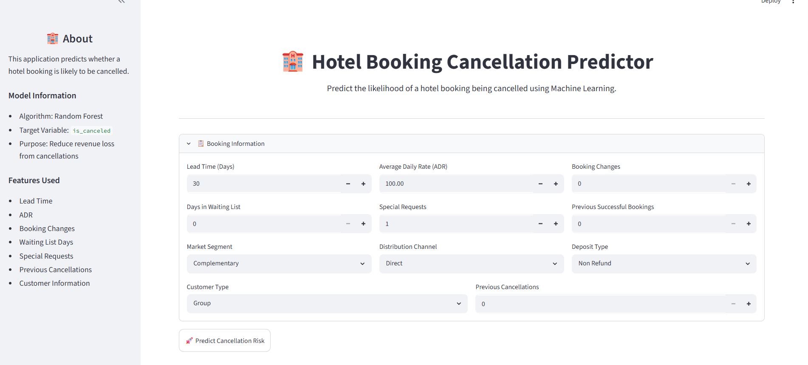
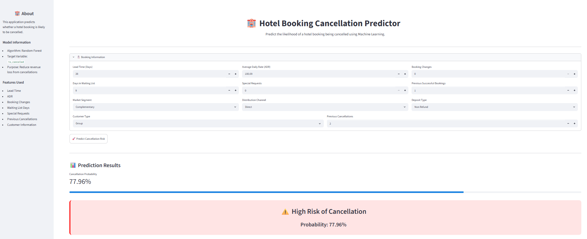

# 🏨 Hotel Booking Cancellation Prediction

A Machine Learning web application that predicts whether a hotel booking is likely to be canceled. The project uses a Random Forest Classifier trained on hotel reservation data and provides an interactive Streamlit interface for real-time predictions.



## 📌 Project Overview

Hotel booking cancellations can significantly impact revenue management and operational planning. This project helps identify bookings that are at risk of cancellation by analyzing customer and reservation details.

Users can enter booking information through a Streamlit dashboard and instantly receive:

* Cancellation prediction
* Cancellation probability score
* Risk assessment (High Risk / Low Risk)


---

## 🚀 Features

* Interactive Streamlit web application
* Real-time cancellation predictions
* Probability-based risk scoring
* Clean and user-friendly interface
* Random Forest machine learning model
* Responsive dashboard layout

---

## 🛠️ Tech Stack

### Programming Language

* Python

### Libraries

* Pandas
* NumPy
* Scikit-learn
* Joblib
* Streamlit

### Machine Learning

* Random Forest Classifier

---

## 📂 Project Structure

```text
hotel-booking-cancellation-prediction/
│
├── main.py                 # Streamlit application
├── prediction.py           # Prediction functions
├── artifacts
|      └── feature_names.pkl           #feature names 
       └── hotel_cancellation_rf.pkl   #Trained Random Forest model
       
├── requirements.txt        # Project dependencies
├── README.md               # Project documentation
│── data
    └── hotel_booking.csv
└── images
    └── overview.png
    └── prediction_image.png
```

---

## 📊 Features Used

The model uses the following booking attributes:

| Feature                        | Description                                 |
| ------------------------------ | ------------------------------------------- |
| lead_time                      | Number of days between booking and arrival  |
| previous_cancellations         | Previous cancellations made by the customer |
| booking_changes                | Number of booking modifications             |
| total_of_special_requests      | Number of special requests                  |
| previous_bookings_not_canceled | Previous successful bookings                |
| adr                            | Average Daily Rate                          |
| days_in_waiting_list           | Days spent on waiting list                  |
| market_segment                 | Booking market segment                      |
| distribution_channel           | Booking distribution channel                |
| deposit_type                   | Deposit status                              |
| customer_type                  | Customer category                           |

---

## 🎯 Model Performance

The final model selected for deployment was a Random Forest Classifier due to its strong predictive performance and ability to capture non-linear relationships.

Example metrics:

* Accuracy:84%
* Precision:80%
* Recall:75%
* F1 Score:77%
* ROC-AUC:90%

---

## 💻 Installation

### 1. Clone the repository

```bash
git clone https://github.com/jeema90/hotel-booking-cancellation-prediction.git
cd hotel-booking-cancellation-prediction
```

### 2. Create a virtual environment

```bash
python -m venv venv
```

Activate the environment:

**Windows**

```bash
venv\Scripts\activate
```

**Mac/Linux**

```bash
source venv/bin/activate
```

### 3. Install dependencies

```bash
pip install -r requirements.txt
```

---

## ▶️ Run the Application

Start the Streamlit application:

```bash
streamlit run main.py
```

The app will open automatically in your browser.

---

## 📸 Application Preview


```text
images/
└── overview.png
```

Example:


---

## 📈 Business Value

This solution can help hotels:

* Identify bookings likely to cancel
* Improve revenue forecasting
* Optimize room allocation
* Support targeted customer retention strategies
* Reduce losses caused by last-minute cancellations

---
## 🧰 Tools & Technologies Used

| Category                | Tools & Technologies      |
| ----------------------- | ------------------------- |
| Programming Language    | Python                    |
| Data Manipulation       | Pandas, NumPy             |
| Data Visualization      | Matplotlib, Seaborn       |
| Machine Learning        | Scikit-learn              |
| Model                   | Random Forest Classifier  |
| Model Serialization     | Joblib                    |
| Web Application         | Streamlit                 |
| Development Environment | Jupyter Notebook, VS Code |
| Version Control         | Git, GitHub               |

## 🛠️ Skills Demonstrated

* Data Cleaning & Preprocessing
* Exploratory Data Analysis (EDA)
* Feature Engineering
* Categorical Variable Encoding
* Machine Learning Classification
* Hyperparameter Tuning
* Model Evaluation
* Probability Prediction
* Streamlit App Development
* Model Deployment
* Git & GitHub Version Control

---

## 👤 Author

Najeemathul Munavvara

* GitHub: https://github.com/jeema90

---

## 📜 License

This project is licensed under the MIT License.

-------